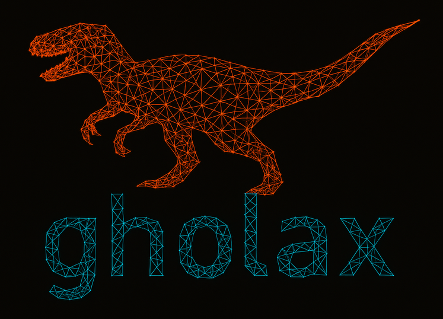

# gholax
<p align="center">

</p>

Differentiable likelihoods through surrogate models. Our logo represents a neural network surrogate model ([ghola](https://dune.fandom.com/wiki/Ghola)) for a theory model (velocileptors in this case).

Neural network surrogate models and data from https://arxiv.org/abs/XXXX.XXXX will be made available upon acceptance of this work. For early access, please contact jderose@bnl.gov.

## Installation
### Dependencies
- `h5py` for reading emulator data
- `numpy`, `scipy`
- `mpi4py` for running multiple chains simultaneously
- `jax`, `jaxlib`
- `blackjax` for sampling algorithms
- `optax` for minimization
- `interpax` for theory calculations

### NERSC Installation
At NERSC you can run `sh setup_nersc_env.sh` and this should create a functional conda environment,
that you can activate as follows:

```bash
module load python
mamba activate gholax
```
This is equipped with a jupyter kernel named `gholax` that you can use with NERSC's jupyterlab.

### Local Installation 
Analogously, assuming you have `mamba` installed, you can run `sh setup_env.sh` and it will build a functioning environment with `gholax` installed. 
environment can then be activated by calling `mamba activate gholax`. 


