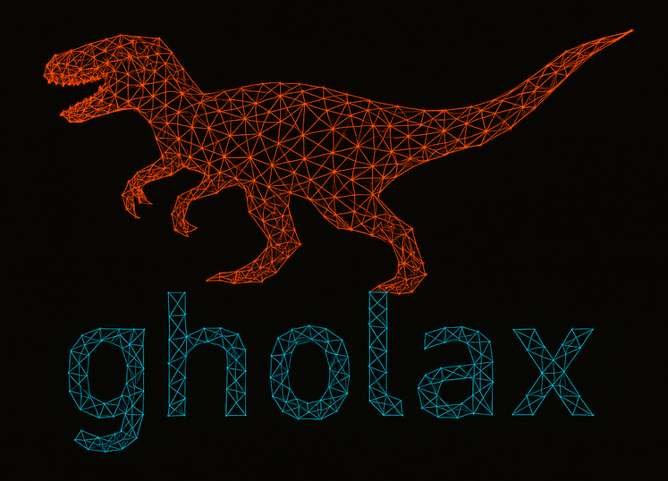

# gholax
<p align="center">

</p>

Differentiable likelihoods through surrogate models. Our logo represents a neural network surrogate model ([ghola](https://dune.fandom.com/wiki/Ghola)) for a theory model ([velocileptors](https://github.com/sfschen/velocileptors) in this case).

Neural network surrogate models and data from https://arxiv.org/abs/2510.18981 will be made available upon acceptance of this work. For early access, please contact jderose@bnl.gov.

## Installation
### Dependencies
- `h5py` for reading emulator data
- `numpy`, `scipy`
- `mpi4py` for running multiple chains simultaneously
- `jax`, `jaxlib`
- `blackjax` for sampling algorithms
- `optax` for minimization
- `interpax` for theory calculations

### NERSC Installation
At NERSC you can run `sh setup_nersc_env.sh` and this should create a functional conda environment,
that you can activate as follows:

```bash
module load python
mamba activate gholax
```
This is equipped with a jupyter kernel named `gholax` that you can use with NERSC's jupyterlab.

### Local Installation 
Analogously, assuming you have `mamba` installed, you can run `sh setup_env.sh` and it will build a functioning environment with `gholax` installed. 
The environment can then be activated by calling `mamba activate gholax`. 

## Config-Space Likelihood

`gholax/likelihood/nx2pt_configspace.py` implements `Nx2PTCorrelationFunction`,
a config-space extension of the existing `Nx2PTAngularPowerSpectrum` likelihood.
Instead of angular power spectra C_ℓ, it computes real-space correlation functions:

- `w(θ)` — galaxy clustering angular correlation function
- `γ_t(θ)` — galaxy-shear cross-correlation
- `ξ+(θ)`, `ξ-(θ)` — cosmic shear correlation functions

The C_ℓ→ξ(θ) transform uses bin-averaged Legendre kernels following
Schneider et al. (2002) Appendix B.

### Validation

Validated against pyccl at a reference ΛCDM cosmology (10–300 arcmin, log-spaced bins).
Differences are consistent with the distinction between bin-averaged values (this code)
and point-evaluated values (pyccl), which is largest at small angles where bins are wide:

- w(θ): <1% agreement ✓
- γ_t(θ): <3% agreement ✓
- ξ+(θ): <9% agreement ✓
- ξ-(θ): <5% agreement at large angles ✓ (larger differences at small angles due to
  numerical cancellation in the G_neg kernel — a known limitation of the bin-averaging
  formula at small separations)

### End-to-end test

A full pipeline test using a dummy data vector and the CLASS Boltzmann code (instead of
emulators) is provided in `examples/`. To run:

```bash
cd gholax-main
python examples/generate_dummy_datavector.py
cp dummy_configspace_dv.h5 examples/dummy_configspace_dv.h5
python examples/test_pipeline_end_to_end.py
```

Expected output:
```
SUCCESS: Pipeline ran end-to-end and produced a finite likelihood.
Chi-squared check PASSED (data consistent with theory at reference cosmology).
=== All tests passed ===
```

### Usage

See `examples/config_configspace_test.yaml` for an example configuration and
`examples/generate_dummy_datavector.py` for generating a test data vector.

**Note:** Full end-to-end MCMC sampling requires emulator weights (contact jderose@bnl.gov).
The `Nx2PTCorrelationFunction` module itself is fully JAX/JIT compatible — the JIT
limitation in the test above comes from the CLASS Boltzmann code used as a fallback,
which is bypassed in production by the emulators.
